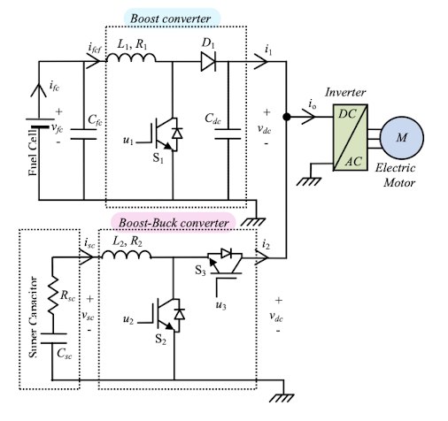
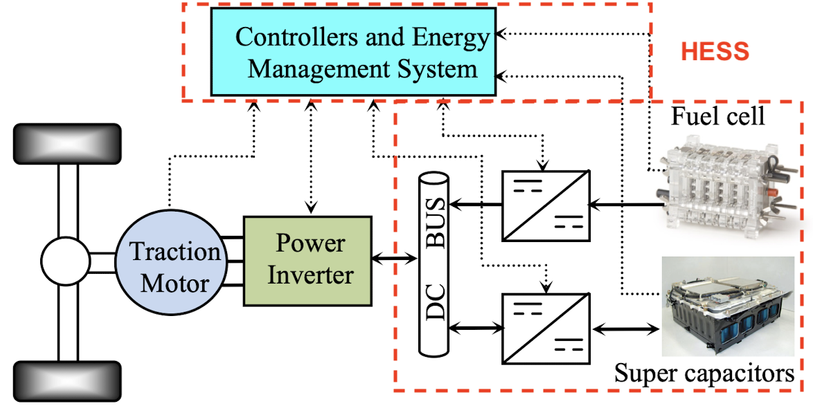

# Control of FuelCell-Supercapacitor Hybrid System

Welcome to the **Control-of-FuelCell-Supercapacitor-Hybrid-System** repository! This project is focused on the simulation and control of a Hybrid Energy Storage System (HESS) for electric vehicles. The HESS consists of two power sources: a **Fuel Cell (FC)** as the main source and a **Supercapacitor (SC)** as the auxiliary source. The system is designed to optimize the power distribution between these sources while ensuring stability, efficiency, and performance.

## Project Overview

The control strategy is based on the approach presented in the paper [[1]](#1), which addresses the challenge of controlling a hybrid energy storage system for electric vehicles. The primary goal is to ensure efficient energy management between the fuel cell and the supercapacitor, which are connected through two converters:

1. **Boost Converter**: Connects the fuel cell (FC) to the DC bus.
2. **Boost-Buck Converter**: Connects the supercapacitor (SC) to the same DC bus.

Both converters supply power to the traction motor through a shared DC bus, which in turn connects to the motor via an inverter.  
<p align="center">
  
</p>
The nonlinear controller used in this system ensures optimal performance by meeting the following key objectives:

### Controller Objectives
1. **Tight DC Bus Voltage Regulation**: The DC bus voltage must remain stable despite variations in load demand.
2. **Accurate Supercapacitor Current Tracking**: The current of the supercapacitor should follow its reference value accurately to ensure optimal auxiliary power supply.
3. **Asymptotic Stability**: The entire closed-loop system, including both power sources and converters, must maintain stability over time.

## System Components

### 1. Fuel Cell (FC)
The fuel cell serves as the primary power source in the HESS. It delivers the base or mean power required by the system. The power output from the FC is regulated through a **non-reversible DC/DC boost converter** to the DC bus.

### 2. Supercapacitor (SC)
The supercapacitor acts as an auxiliary power source that handles transient power demands and provides peak currents during high-power events such as acceleration and deceleration. A **reversible DC/DC boost-buck converter** is used to control the SC’s power contribution to the DC bus.

### 3. Power Converters
- **Boost Converter (FC)**: Connects the fuel cell to the DC bus, regulating the power flow.
- **Boost-Buck Converter (SC)**: Connects the supercapacitor to the DC bus, enabling bidirectional power flow for both charging and discharging.

### 4. DC Bus & Traction Motor
Both converters feed into a common DC bus that supplies power to the electric vehicle's **traction motor** via an inverter. The tight regulation of the DC bus voltage is critical for ensuring smooth operation of the motor.  
<p align="center">
 
</p>

## Simulation Goals

This repository provides the simulation of the nonlinear control strategy designed to meet the following performance goals:
- **Stable DC Bus Voltage** under varying loads.
- **Accurate SC Current Tracking** to match the reference current.
- **System Stability** over long-term operation, ensuring that the hybrid energy system remains efficient and safe.

## Getting Started

### Prerequisites
To run the simulation, you will need MATLAB/Simulink (recommended version: R2021b or later).

### Running the simulation
1. Clone this repository
   ```bash
   git clone https://github.com/yourusername/Control-of-FuelCell-Supercapacitor-Hybrid-System.git
2. Open MATLAB and navigate to this project folder.
3.  Run the [main simulation](main_simulation.slx) to launch the simulation and observe the control performance.

## References
<a id="1">[1]</a> 
Hassan El Fadil et al. “Modeling and nonlinear control of a fuel cell/supercapacitor
hybrid energy storage system for electric vehicles.” In: IEEE Transactions on
Vehicular Technology 63.7 (2014), pages 3011–3018.

## Contributing
Feel free to contribute to this repository by submitting pull requests or opening issues. If you have any questions or ideas, don't hesitate to reach out—I'd like to collaborate with you!  

Happy simulating! 🚗🔋⚡


